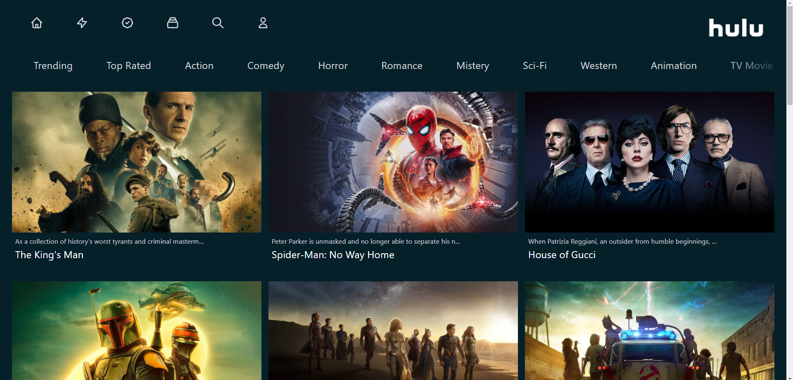

# Hulu 2.0 🍿🎬

> "Hulu 2.0 🍿🎬" is a clone build inspired by the official [Hulu](https://www.hulu.com/) website. This clone retrieves data from the TMDB webpage and displays movies and shows.  
>
> - Lazy Loading.
> - Responsive.



## 🏗️ Built With

- Tailwind CSS
- JavaScript
- Next JS

## 🖇️ LiveLink

- [Heroku App](https://hulu-clone-2.herokuapp.com/)

## 🛫 Getting Started

To get a local copy up and running, follow the steps in Setup below.

### Prerequisites

Basic knowledge of HTML, CSS, and JavaScript.

### Setup

If you installed git you can clone the code to your machine, or download a ZIP of all the files directly.
[Download the ZIP from this location](https://github.com/tmampa/hulu-2.0), or run the following [git](https://github.com/tmampa/hulu-2.0.git) command to clone the files to your machine:

```bash
git clone https://github.com/tmampa/hulu-2.0.git
```

- Once the files are on your machine, open the _Leaderboard_ folder in [Visual Studio Code](https://code.visualstudio.com/), and follow the steps in Installation & Set Up

## 🛠 Installation & Set Up

1. Install Node Modules

   ```sh
   npm install
   ```

2. Start the development server

   ```sh
   npm start
   ```

3. Open [http://localhost:8080](http://localhost:8080) to view it in the browser.

## 🚀 Building and Running for Production

1. Generate a full static production build

   ```sh
   npm run build
   ```

## 🧪 Running Tests with Jest

1. Start the development server

   ```sh
   npm run test
   ```

### 💉 Install

The following tools help make easier to work with sample code.

- [git](https://git-scm.com/downloads): A tool for managing source code
- [Visual Studio Code](https://code.visualstudio.com/): A source code editor


## 👨🏾‍💻 Author

👤 **Tshephang Mampa**

- GitHub: [tmampa](https://github.com/tmampa)
- LinkedIn: [Tshephang Mampa](https://linkedin.com/tshephangmampa)
- Twitter: [Tshephangm\_](https://twitter.com/tshephangm_)

## 🤝 Contributing

Contributions, issues, and feature requests are welcome!

## ❤️ Show your support

Give a ⭐️ if you like this project!

## Acknowledgments

- Thank you for Microverse for providing the required materials

## 📝 License
